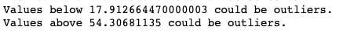
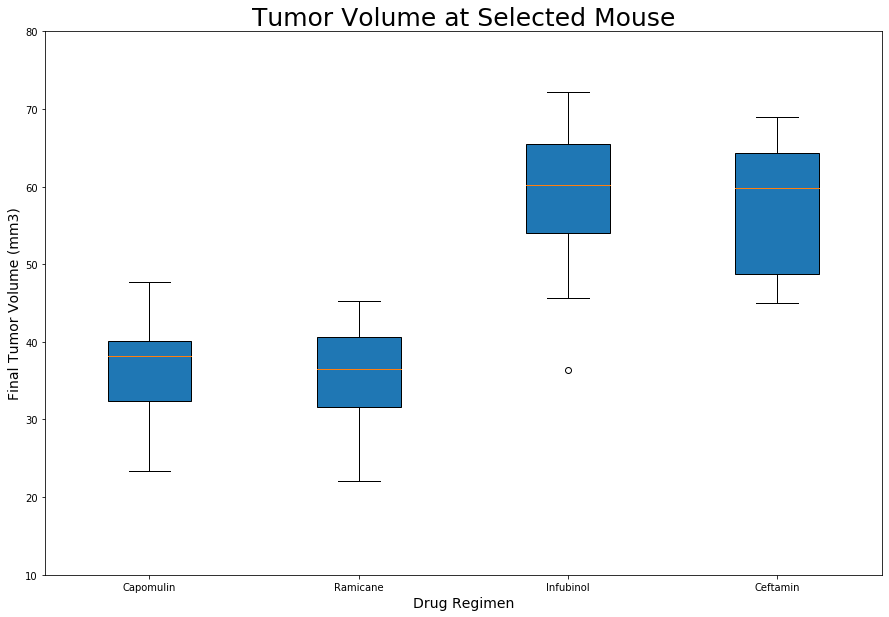

# Matplotlib - The Power of Plots

#### "Visual storytelling of one kind or another has been around since caveman were drawing on the walls." Frank Darabont


## Background
These respository apply a Python Matplotlib to visualize a real-world Pymaceuticals data. The data is sourced from Pymaceuticals Inc., a burgeoning pharmaceutical company based out of San Diego. Pymaceuticals specializes in anti-cancer pharmaceuticals. In its most recent efforts, it began screening for potential treatments for squamous cell carcinoma (SCC), a commonly occurring form of skin cancer.

This analysis used a complete data from their most recent animal study in two datasets in CSV format. Data set one is [Mouse_metadata.csv](Pymaceuticals/data/Mouse_metadata.csv) wich includes 249 mice identified data with SCC tumor growth were treated through a variety of drug `regimens`, and their `Sex`, `Age_months`	and `Weight (g)`. The other dataset is [Study_results.csv](Pymaceuticals/data/Study_results.csv) file which includes the results of the study in each columns `Mouse I`,`Timepoint`,`Tumor Volume (mm3)`, and `Metastatic Sites`.

The purpose of this study was to compare the performance of Pymaceuticals' drug of interest, Capomulin, versus the other treatment regimens. The analysis also generated all of the table and figures needed for the technical, and top-level summary report of the study. For this analysis both datasets imported, merged,cleaned and the aggregate data diplayed in to Python Pandas dataframes, visualized in Matplotlib, and other libraries used in order to make a stastical analysis. The project is conducted in Jupyter notebook to showcase, and communicate the analysis report the following link is created: [Jupyter Notebook Viewer](https://nbviewer.jupyter.org/github/ermiasgelaye/Matplotlib-Challenge/blob/master/Pymaceuticals/.ipynb_checkpoints/pymaceuticals_starter-checkpoint.ipynb) 

## Observable Trends

* 

* 

## Table of Contents
[Data cleaning](https://github.com/ermiasgelaye/Matplotlib-Challenge/edit/master/README.md/## Data Cleaning)
[summary statistics](https://github.com/ermiasgelaye/Matplotlib-Challenge/edit/master/README.md/## Summary statistics)
Bar and Pie Charts](https://github.com/ermiasgelaye/Matplotlib-Challenge/edit/master/README.md/## Bar and Pie Charts)
[Quartiles, Outliers and Boxplots](https://github.com/ermiasgelaye/Matplotlib-Challenge/edit/master/README.md/## Quartiles, Outliers and Boxplots)
[Line and Scatter Plots](https://github.com/ermiasgelaye/Matplotlib-Challenge/edit/master/README.md/## Line and Scatter Plots)
[Correlation and Regression](https://github.com/ermiasgelaye/Matplotlib-Challenge/edit/master/README.md/## Correlation and Regression)


## Solutions

## Data Cleaning
* The data was loaded, read, combined, duplicate removed, and the head (5 rows on the top) of cleaned data out put looks as follows

<table border="1" class="dataframe">
  <thead>
    <tr>
      <th></th>
      <th>Mouse ID</th>
      <th>Drug Regimen</th>
      <th>Sex</th>
      <th>Age_months</th>
      <th>Weight (g)</th>
      <th>Timepoint</th>
      <th>Tumor Volume (mm3)</th>
      <th>Metastatic Sites</th>
    </tr>
  </thead>
  <tbody>
    <tr>
      <th>0</th>
      <td>k403</td>
      <td>Ramicane</td>
      <td>Male</td>
      <td>21</td>
      <td>16</td>
      <td>0</td>
      <td>45.000000</td>
      <td>0</td>
    </tr>
    <tr>
      <th>1</th>
      <td>k403</td>
      <td>Ramicane</td>
      <td>Male</td>
      <td>21</td>
      <td>16</td>
      <td>5</td>
      <td>38.825898</td>
      <td>0</td>
    </tr>
    <tr>
      <th>2</th>
      <td>k403</td>
      <td>Ramicane</td>
      <td>Male</td>
      <td>21</td>
      <td>16</td>
      <td>10</td>
      <td>35.014271</td>
      <td>1</td>
    </tr>
    <tr>
      <th>3</th>
      <td>k403</td>
      <td>Ramicane</td>
      <td>Male</td>
      <td>21</td>
      <td>16</td>
      <td>15</td>
      <td>34.223992</td>
      <td>1</td>
    </tr>
    <tr>
      <th>4</th>
      <td>k403</td>
      <td>Ramicane</td>
      <td>Male</td>
      <td>21</td>
      <td>16</td>
      <td>20</td>
      <td>32.997729</td>
      <td>1</td>
    </tr>
  </tbody>
</table>

## Summary statistics

* A summary statistics table was generated by using two techniques one is by creating multiple series, and putting them all together at the end, and the other method produces everything in a single groupby function. The summery statistic table consis the mean, median, variance, standard deviation, and SEM of the tumor volume for each drug regimen. The summery stastics tables looks as follws:

<table border="1" class="dataframe">
  <thead>
    <tr>
      <th></th>
      <th>Mean</th>
      <th>Median</th>
      <th>Variance</th>
      <th>Standard Deviation</th>
      <th>SEM</th>
    </tr>
    <tr>
      <th>Drug Regimen</th>
    </tr>
    <tr>
      <th>Capomulin</th>
      <td>40.675741</td>
      <td>41.557809</td>
      <td>24.947764</td>
      <td>4.994774</td>
      <td>0.329346</td>
    </tr>
    <tr>
      <th>Ceftamin</th>
      <td>52.591172</td>
      <td>51.776157</td>
      <td>39.290177</td>
      <td>6.268188</td>
      <td>0.469821</td>
    </tr>
    <tr>
      <th>Infubinol</th>
      <td>52.884795</td>
      <td>51.820584</td>
      <td>43.128684</td>
      <td>6.567243</td>
      <td>0.492236</td>
    </tr>
    <tr>
      <th>Ketapril</th>
      <td>55.235638</td>
      <td>53.698743</td>
      <td>68.553577</td>
      <td>8.279709</td>
      <td>0.603860</td>
    </tr>
    <tr>
      <th>Naftisol</th>
      <td>54.331565</td>
      <td>52.509285</td>
      <td>66.173479</td>
      <td>8.134708</td>
      <td>0.596466</td>
    </tr>
    <tr>
      <th>Placebo</th>
      <td>54.033581</td>
      <td>52.288934</td>
      <td>61.168083</td>
      <td>7.821003</td>
      <td>0.581331</td>
    </tr>
    <tr>
      <th>Propriva</th>
      <td>52.320930</td>
      <td>50.446266</td>
      <td>43.852013</td>
      <td>6.622085</td>
      <td>0.544332</td>
    </tr>
    <tr>
      <th>Ramicane</th>
      <td>40.216745</td>
      <td>40.673236</td>
      <td>23.486704</td>
      <td>4.846308</td>
      <td>0.320955</td>
    </tr>
    <tr>
      <th>Stelasyn</th>
      <td>54.233149</td>
      <td>52.431737</td>
      <td>59.450562</td>
      <td>7.710419</td>
      <td>0.573111</td>
    </tr>
    <tr>
      <th>Zoniferol</th>
      <td>53.236507</td>
      <td>51.818479</td>
      <td>48.533355</td>
      <td>6.966589</td>
      <td>0.516398</td>
</table>
  
## Bar and Pie Charts
  
* Two identical bar charts was generated by using both Pandas's `DataFrame.plot()` and Matplotlib's `pyplot` that shows  the number of total mice for each treatment regimen throughout the course of the study.

  The Bar Cahrts looks as follows:

#### Bar Chart on the Number of Mice per Treatment (Pandas's `DataFrame.plot()`)


#### Bar Chart on the Number of Mice per Treatment (Matplotlib's `pyplot`)


* Two identical pie plot was generated by using both Pandas's `DataFrame.plot()` and Matplotlib's `pyplot` that shows the distribution of female or male mice in the study.

#### Pi Chart on the distribution of female or male mice in the study (Pandas's `DataFrame.plot()`)

#### Pi Chart on the distribution of female or male mice in the study (Matplotlib's `pyplot`)


## Quartiles, Outliers and Boxplots

* The final tumor volume of each mouse across four of the most promising treatment regimens was created: Capomulin, Ramicane, Infubinol, and Ceftamin. Afterward the quartiles, IQR, and potential outliers across all the four treatment regimens was quantitatively determined.

#### Capomulin Final Tumor Volume
<table border="1" class="dataframe">
  <thead>
    <tr>
      <th></th>
      <th>Mouse ID</th>
      <th>Timepoint</th>
      <th>Drug Regimen</th>
      <th>Sex</th>
      <th>Age_months</th>
      <th>Weight (g)</th>
      <th>Tumor Volume (mm3)</th>
      <th>Metastatic Sites</th>
    </tr>
  </thead>
  <tbody>
    <tr>
      <th>0</th>
      <td>b128</td>
      <td>45</td>
      <td>Capomulin</td>
      <td>Female</td>
      <td>9</td>
      <td>22</td>
      <td>38.982878</td>
      <td>2</td>
    </tr>
    <tr>
      <th>1</th>
      <td>b742</td>
      <td>45</td>
      <td>Capomulin</td>
      <td>Male</td>
      <td>7</td>
      <td>21</td>
      <td>38.939633</td>
      <td>0</td>
    </tr>
    <tr>
      <th>2</th>
      <td>f966</td>
      <td>20</td>
      <td>Capomulin</td>
      <td>Male</td>
      <td>16</td>
      <td>17</td>
      <td>30.485985</td>
      <td>0</td>
    </tr>
    <tr>
      <th>3</th>
      <td>g288</td>
      <td>45</td>
      <td>Capomulin</td>
      <td>Male</td>
      <td>3</td>
      <td>19</td>
      <td>37.074024</td>
      <td>1</td>
    </tr>
    <tr>
      <th>4</th>
      <td>g316</td>
      <td>45</td>
      <td>Capomulin</td>
      <td>Female</td>
      <td>22</td>
      <td>22</td>
      <td>40.159220</td>
      <td>2</td>
    </tr>
  </tbody>
</table>

#### Capomulin Quartiles and IQR
```python
Capomulin_tumors = Capomulin_merge["Tumor Volume (mm3)"]

quartiles =Capomulin_tumors.quantile([.25,.5,.75])
lowerq = quartiles[0.25]
upperq = quartiles[0.75]
iqr = upperq-lowerq


print(f"The lower quartile of Capomulin tumors: {lowerq}")
print(f"The upper quartile of Capomulin tumors: {upperq}")
print(f"The interquartile range of Capomulin tumors: {iqr}")
print(f"The median of Capomulin tumors: {quartiles[0.5]} ")
```
   The output looks as follws:


#### Capomulin Outliers using upper and lower bounds
```python 
lower_bound = lowerq - (1.5*iqr)
upper_bound = upperq + (1.5*iqr)

print(f"Capomulin treatment tumors volume potential outliers could be found between {lower_bound} and above {upper_bound} could be outliers.")
```
The output looks as follws:


#### Ramicane Final Tumor Volume
<table border="1" class="dataframe">
  <thead>
    <tr>
      <th></th>
      <th>Mouse ID</th>
      <th>Timepoint</th>
      <th>Drug Regimen</th>
      <th>Sex</th>
      <th>Age_months</th>
      <th>Weight (g)</th>
      <th>Tumor Volume (mm3)</th>
      <th>Metastatic Sites</th>
    </tr>
  </thead>
  <tbody>
    <tr>
      <th>0</th>
      <td>a411</td>
      <td>45</td>
      <td>Ramicane</td>
      <td>Male</td>
      <td>3</td>
      <td>22</td>
      <td>38.407618</td>
      <td>1</td>
    </tr>
    <tr>
      <th>1</th>
      <td>a444</td>
      <td>45</td>
      <td>Ramicane</td>
      <td>Female</td>
      <td>10</td>
      <td>25</td>
      <td>43.047543</td>
      <td>0</td>
    </tr>
    <tr>
      <th>2</th>
      <td>a520</td>
      <td>45</td>
      <td>Ramicane</td>
      <td>Male</td>
      <td>13</td>
      <td>21</td>
      <td>38.810366</td>
      <td>1</td>
    </tr>
    <tr>
      <th>3</th>
      <td>a644</td>
      <td>45</td>
      <td>Ramicane</td>
      <td>Female</td>
      <td>7</td>
      <td>17</td>
      <td>32.978522</td>
      <td>1</td>
    </tr>
    <tr>
      <th>4</th>
      <td>c458</td>
      <td>30</td>
      <td>Ramicane</td>
      <td>Female</td>
      <td>23</td>
      <td>20</td>
      <td>38.342008</td>
      <td>2</td>
    </tr>
  </tbody>
</table>

#### Ramicane Quartiles and IQR
```python
Ramicane_tumors = Ramicane_merge["Tumor Volume (mm3)"]

quartiles =Ramicane_tumors.quantile([.25,.5,.75])
lowerq = quartiles[0.25]
upperq = quartiles[0.75]
iqr = upperq-lowerq


print(f"The lower quartile of Ramicane tumors is: {lowerq}")
print(f"The upper quartile of Ramicane tumors is: {upperq}")
print(f"The interquartile range of Ramicane tumors is: {iqr}")
print(f"The median of Ramicane tumors is: {quartiles[0.5]} ")

```
   The output looks as follws:


  
#### Ramicane Outliers using upper and lower bounds
```python 
lower_bound = lowerq - (1.5*iqr)
upper_bound = upperq + (1.5*iqr)

print(f"Ramicane treatment tumors volume potential outliers could be found between {lower_bound} and above {upper_bound} could be outliers.")
```
   The output looks as follws:


#### Infubinol Final Tumor Volume
<table border="1" class="dataframe">
  <thead>
    <tr>
      <th></th>
      <th>Mouse ID</th>
      <th>Timepoint</th>
      <th>Drug Regimen</th>
      <th>Sex</th>
      <th>Age_months</th>
      <th>Weight (g)</th>
      <th>Tumor Volume (mm3)</th>
      <th>Metastatic Sites</th>
    </tr>
  </thead>
  <tbody>
    <tr>
      <th>0</th>
      <td>a203</td>
      <td>45</td>
      <td>Infubinol</td>
      <td>Female</td>
      <td>20</td>
      <td>23</td>
      <td>67.973419</td>
      <td>2</td>
    </tr>
    <tr>
      <th>1</th>
      <td>a251</td>
      <td>45</td>
      <td>Infubinol</td>
      <td>Female</td>
      <td>21</td>
      <td>25</td>
      <td>65.525743</td>
      <td>1</td>
    </tr>
    <tr>
      <th>2</th>
      <td>a577</td>
      <td>30</td>
      <td>Infubinol</td>
      <td>Female</td>
      <td>6</td>
      <td>25</td>
      <td>57.031862</td>
      <td>2</td>
    </tr>
    <tr>
      <th>3</th>
      <td>a685</td>
      <td>45</td>
      <td>Infubinol</td>
      <td>Male</td>
      <td>8</td>
      <td>30</td>
      <td>66.083066</td>
      <td>3</td>
    </tr>
    <tr>
      <th>4</th>
      <td>c139</td>
      <td>45</td>
      <td>Infubinol</td>
      <td>Male</td>
      <td>11</td>
      <td>28</td>
      <td>72.226731</td>
      <td>2</td>
    </tr>
  </tbody>
</table>


#### Infubinol Quartiles and IQR
```python
Infubinol_last = Infubinol_df.groupby('Mouse ID').max()['Timepoint']
Infubinol_vol = pd.DataFrame(Infubinol_last)
Infubinol_merge = pd.merge(Infubinol_vol, Combined_data, on=("Mouse ID","Timepoint"),how="left")
Infubinol_merge.head()
```
   The output looks as follws:


#### Infubinol Outliers using upper and lower bounds
```python
lower_bound = lowerq - (1.5*iqr)
upper_bound = upperq + (1.5*iqr)

print(f"Infubinol treatment tumors volume potential outliers could be found between {lower_bound} and above {upper_bound} could be outliers.")
```
   The output looks as follws:


#### Ceftamin Final Tumor Volume
<table border="1" class="dataframe">
  <thead>
    <tr>
      <th></th>
      <th>Mouse ID</th>
      <th>Timepoint</th>
      <th>Drug Regimen</th>
      <th>Sex</th>
      <th>Age_months</th>
      <th>Weight (g)</th>
      <th>Tumor Volume (mm3)</th>
      <th>Metastatic Sites</th>
    </tr>
  </thead>
  <tbody>
    <tr>
      <th>0</th>
      <td>a275</td>
      <td>45</td>
      <td>Ceftamin</td>
      <td>Female</td>
      <td>20</td>
      <td>28</td>
      <td>62.999356</td>
      <td>3</td>
    </tr>
    <tr>
      <th>1</th>
      <td>b447</td>
      <td>0</td>
      <td>Ceftamin</td>
      <td>Male</td>
      <td>2</td>
      <td>30</td>
      <td>45.000000</td>
      <td>0</td>
    </tr>
    <tr>
      <th>2</th>
      <td>b487</td>
      <td>25</td>
      <td>Ceftamin</td>
      <td>Female</td>
      <td>6</td>
      <td>28</td>
      <td>56.057749</td>
      <td>1</td>
    </tr>
    <tr>
      <th>3</th>
      <td>b759</td>
      <td>30</td>
      <td>Ceftamin</td>
      <td>Female</td>
      <td>12</td>
      <td>25</td>
      <td>55.742829</td>
      <td>1</td>
    </tr>
    <tr>
      <th>4</th>
      <td>f436</td>
      <td>15</td>
      <td>Ceftamin</td>
      <td>Female</td>
      <td>3</td>
      <td>25</td>
      <td>48.722078</td>
      <td>2</td>
    </tr>
  </tbody>
</table>

#### Ceftamin Quartiles and IQR
```python
Ceftamin_tumors = Ceftamin_merge["Tumor Volume (mm3)"]

quartiles = Ceftamin_tumors.quantile([.25,.5,.75])
lowerq = quartiles[0.25]
upperq = quartiles[0.75]
iqr = upperq-lowerq

print(f"The lower quartile of treatment Cap: {lowerq}")
print(f"The upper quartile of temperatures is: {upperq}")
print(f"The interquartile range of temperatures is: {iqr}")
print(f"The the median of temperatures is: {quartiles[0.5]} ")
```

   The output looks as follws:


#### Ceftamin Outliers using upper and lower bounds
```python
lower_bound = lowerq - (1.5*iqr)
upper_bound = upperq + (1.5*iqr)
print(f"Values below {lower_bound} could be outliers.")
print(f"Values above {upper_bound} could be outliers.")
```
   The output looks as follws:


## Box and Whisker Plot

* A box and whisker plot of the final tumor volume for all four treatment regimens was generated, and a potential outliers highlighted by using color, and style.

A box and whisker plot looks as follws:


## Line and Scatter Plots
###  Line Plot
* A line plot created on selected mouse (`b742`) that was treated with Capomulin, and generate a line plot of time point versus tumor volume for that mouse.

   A line plot looks as follws:


###  Scatter Plot
* A scatter plot of mouse weight versus average tumor volume for the Capomulin treatment regimen was created. 

   A scatter plot looks as follws:


## Correlation and Regression

* A correlation coefficient, and linear regression analysis was conducted  between mouse weight and average tumor volume for the Capomulin treatment. A Plot of the linear regression model created on top of the previous scatter plot.

### Correlation
```python 
corr=round(st.pearsonr(avg_capm_vol['Weight (g)'],avg_capm_vol['Tumor Volume (mm3)'])[0],2)
print(f"The correlation between mouse weight and average tumor volume is {corr}")
```
   A line plot looks as follws:


### Regression
```python 
x_values = avg_capm_vol['Weight (g)']
y_values = avg_capm_vol['Tumor Volume (mm3)']

(slope, intercept, rvalue, pvalue, stderr) = linregress(x_values, y_values)
regress_values = x_values * slope + intercept

print(f"slope:{slope}")
print(f"intercept:{intercept}")
print(f"rvalue (Correlation coefficient):{rvalue}")
print(f"pandas (Correlation coefficient):{corr}")
print(f"stderr:{stderr}")

line_eq = "y = " + str(round(slope,2)) + "x + " + str(round(intercept,2))

print(line_eq)
```
   A linear regression output looks as follws:


### Adding a linear regression line to the scatter plot
```python
fig1, ax1 = plt.subplots(figsize=(15, 10))
plt.scatter(x_values,y_values,s=175, color="blue")
plt.plot(x_values,regress_values,"r-")
plt.xlabel('Weight(g)',fontsize =14)
plt.ylabel('Average Tumore Volume (mm3)',fontsize =14)
ax1.annotate(line_eq, xy=(20, 40), xycoords='data',xytext=(0.8, 0.95), textcoords='axes fraction',horizontalalignment='right', verticalalignment='top',fontsize=30,color="red")
plt.savefig("../Images/linear_regression.png", bbox_inches = "tight")
plt.show()
```
   A linear regression plot looks as follws:


### Copyright

Trilogy Education Services © 2020. All Rights Reserved.
